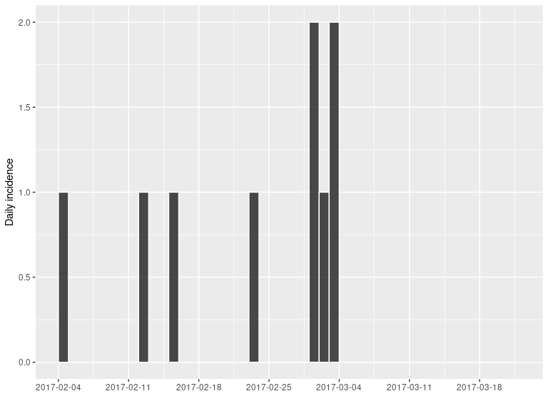
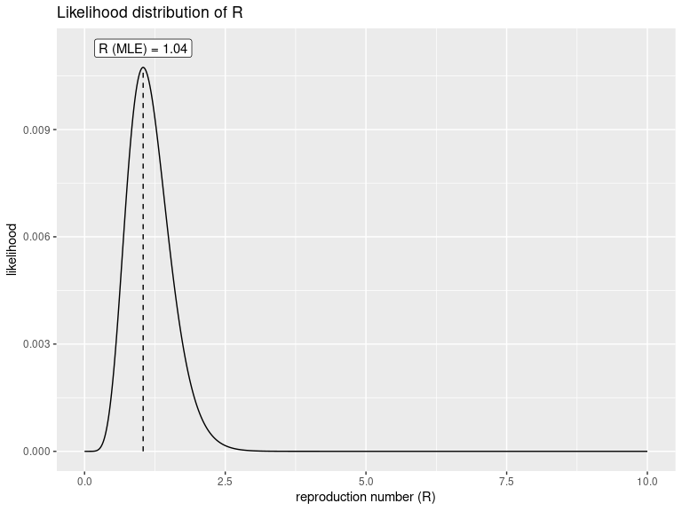
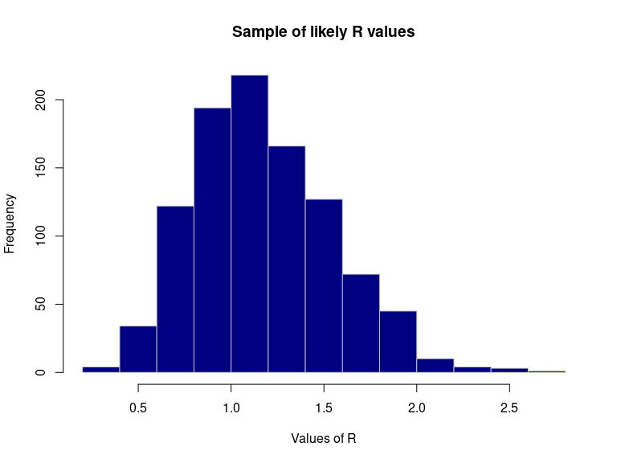
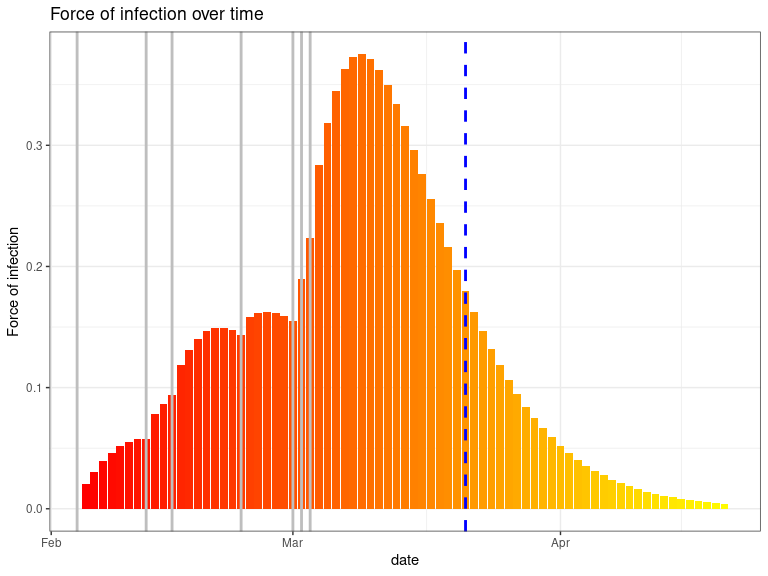

<!-- README.md is generated from README.Rmd. Please edit that file -->

<!-- badges: start -->

[](https://github.com/reconhub/earlyR/actions)
[](https://codecov.io/gh/reconhub/earlyR?branch=master)
[](https://CRAN.R-project.org/package=earlyR)
<!-- badges: end -->

# Welcome to the *earlyR* package\!

This package implements simple estimation of infectiousness, as measured
by the reproduction number (R), in the early stages of an outbreak. This
estimation requires:

  - **prior knowledge**: the **serial interval** distribution, defined
    as the *mean* and *standard deviation* of the (Gamma) distribution.
    In general, these parameters are best taken from the literature.

  - **data**: the daily **incidence** of the disease, including **only
    confirmed and probable** cases.

## Installing the package

To install the current stable, CRAN version of the package, type:

``` r
install.packages("earlyR")
```

To benefit from the latest features and bug fixes, install the
development, *github* version of the package using:

``` r
devtools::install_github("reconhub/earlyR")
```

Note that this requires the package *devtools* installed.

# What does it do?

The main features of the package include:

  - **`get_R`**: a function to estimate *R* as well as the force of
    infection over time, from incidence data; output is an object of
    class `earlyR`

  - **`sample_R`**: a function to obtain a sample of likely *R* values

  - **`plot`**: a function to visualise `earlyR` objects (*R* or force
    of infection).

  - **`points`**: a function using `earlyR` objects to add the force of
    infection to an existing plot.

# Resources

## Worked example

This example is a simplified version of the [*introductory
vignette*](http://www.repidemicsconsortium.org/earlyR/articles/earlyR.html)
(see section below), where `earlyR` is used in conjunction with other
packages to assess infectiousness and growth potential of an early Ebola
Virus Disease (EVD) outbreak. Here, we simply illustrate how `earlyR`
can be used for assessing infectiousness based on a few
confirmed/probable cases.

In this example we assume a small outbreak of Ebola Virus Disease (EVD),
for which the serial interval has been previously characterised. We
study a fake outbreak, for which we will quantify infectiousness (R),
and then project future incidence using the package
[*projections*](https://github.com/reconhub/projections).

The fake data we consider consist of confirmed cases with the following
symptom onset dates:

``` r

onset <- as.Date(c("2017-02-04", "2017-02-12", "2017-02-15",
                   "2017-02-23", "2017-03-01", "2017-03-01",
           "2017-03-02", "2017-03-03", "2017-03-03"))        
```

We assume the current date is 21st March. We compute the daily incidence
using the package [*incidence*](https://github.com/reconhub/incidence):

``` r

library(incidence)
today <- as.Date("2017-03-21")
i <- incidence(onset, last_date = today)
i
#> <incidence object>
#> [9 cases from days 2017-02-04 to 2017-03-21]
#> 
#> $counts: matrix with 46 rows and 1 columns
#> $n: 9 cases in total
#> $dates: 46 dates marking the left-side of bins
#> $interval: 1 day
#> $timespan: 46 days
#> $cumulative: FALSE
plot(i, border = "white")
```



**Note:** It is **very important to make sure that the last days without
cases are included here**. Omitting this information would lead to an
over-estimation of the reproduction number (*R*).

For estimating *R*, we need estimates of the mean and standard deviation
of the serial interval, i.e. the delay between primary and secondary
symptom onset dates. This has been quantified durin the West African EVD
outbreak (WHO Ebola Response Team (2014) NEJM 371:1481–1495):

``` r

mu <- 15.3 # mean in days days
sigma <- 9.3 # standard deviation in days
```

The function `get_R` is then used to estimate the most likely values of
*R*:

``` r

library(earlyR)
library(ggplot2)

res <- get_R(i, si_mean = mu, si_sd = sigma)
res
#> 
#> /// Early estimate of reproduction number (R) //
#>  // class: earlyR, list
#> 
#>  // Maximum-Likelihood estimate of R ($R_ml):
#> [1] 1.041041
#> 
#> 
#>  // $lambda:
#>   NA 0.01838179 0.0273192 0.03514719 0.0414835 0.04623398...
#> 
#>  // $dates:
#> [1] "2017-02-04" "2017-02-05" "2017-02-06" "2017-02-07" "2017-02-08"
#> [6] "2017-02-09"
#> ...
#> 
#>  // $si (serial interval):
#> A discrete distribution
#>   name: gamma
#>   parameters:
#>     shape: 2.70655567117586
#>     scale: 5.65294117647059
plot(res)
```



The first figure shows the distribution of likely values of *R*, and the
Maximum-Likelihood (ML) estimation. To derive other statistics for this
distribution, we can use `sample_R` to get a large sample of likely *R*
values, and then compute statistics on this sample:

``` r

R_val <- sample_R(res, 1000)
summary(R_val) # basic stats
#>    Min. 1st Qu.  Median    Mean 3rd Qu.    Max. 
#>  0.1902  0.9009  1.1211  1.1774  1.4314  2.7427
quantile(R_val) # quartiles
#>        0%       25%       50%       75%      100% 
#> 0.1901902 0.9009009 1.1211211 1.4314314 2.7427427
quantile(R_val, c(0.025, 0.975)) # 95% credibility interval
#>      2.5%     97.5% 
#> 0.5705706 2.0420420
hist(R_val, border = "grey", col = "navy",
     xlab = "Values of R",
     main = "Sample of likely R values")
```



Finally, we can also represent infectiousness over time using:

``` r
plot(res, "lambdas", scale = length(onset) + 1) +
  geom_vline(xintercept = onset, col = "grey", lwd = 1.5) +
  geom_vline(xintercept = today, col = "blue", lty = 2, lwd = 1.5)
#> Warning: Removed 1 rows containing missing values (position_stack).
```



This figure shows the global force of infection over time, with vertical
grey bars indicating the dates of symptom of onset. The dashed blue line
indicates current day. Note that the vertical scale for the bars is
arbitrary, and only represents the relative force of infection.

## Vignettes

\`Currently available vignettes can be accessed from *R* using:

  - `vignette("earlyR")`: an [introduction to
    `earlyR`](http://www.repidemicsconsortium.org/earlyR/articles/earlyR.html)
    using a simulated Ebola Virus Disease (EVD) outbreak; includes
    projections of future incidence using *projections*.

## Websites

A dedicated website is still in development.

## Getting help online

Bug reports and feature requests should be posted on *github* using the
[*issue*](http://github.com/reconhub/earlyR/issues) system. All other
questions should be posted on the **RECON forum**: <br>
<http://www.repidemicsconsortium.org/forum/>

Contributions are welcome via **pull requests**.

Please note that this project is released with a [Contributor Code of
Conduct](CONDUCT.md). By participating in this project you agree to
abide by its terms.
