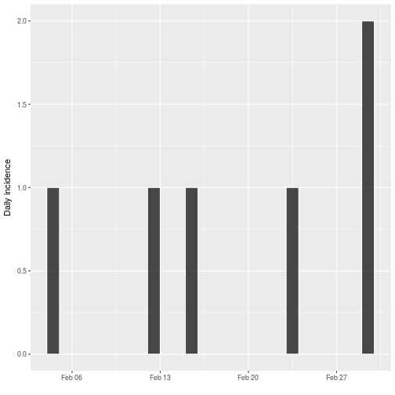
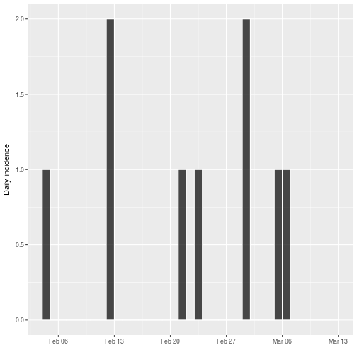
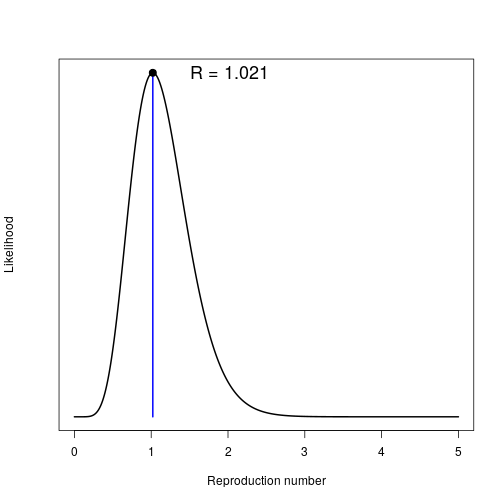
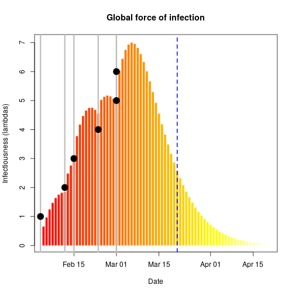
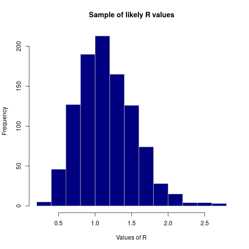
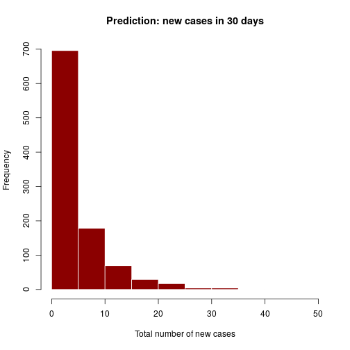
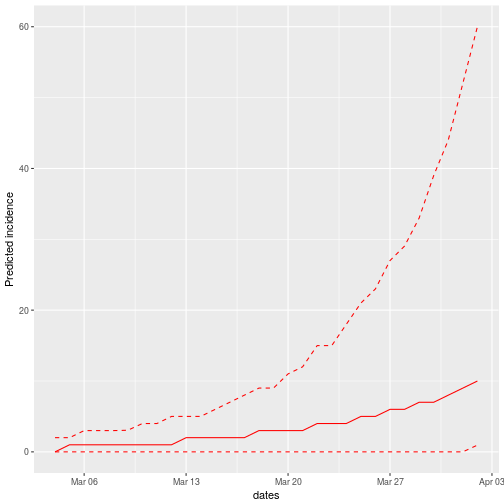
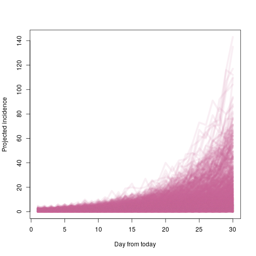
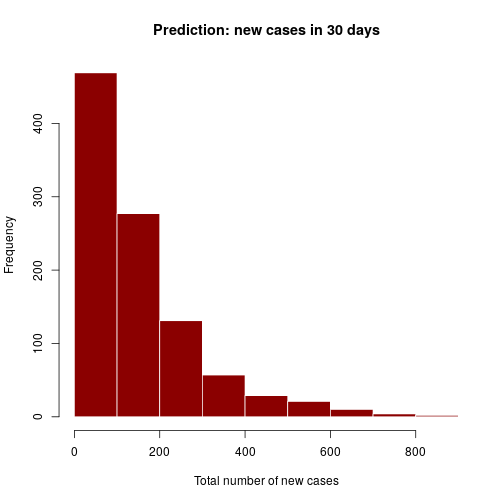

[](https://travis-ci.org/reconhub/earlyR)
[](https://ci.appveyor.com/project/thibautjombart/earlyr/branch/master)
[](https://codecov.io/github/reconhub/earlyR?branch=master)
[](https://cran.r-project.org/package=earlyR)

# Welcome to the *earlyR* package!

This package implements simple estimation of infectiousness, as measured by the
reproduction number (R), in the early stages of an outbreak. This estimation requires:

- **prior knowledge**: the **serial interval** distribution, defined as the *mean* and
*standard deviation* of the (Gamma) distribution. In general, these parameters
are best taken from the literature.

- **data**: the daily **incidence** of the disease, including **only confirmed
    and probable** cases.


## Installing the package

To install the current stable, CRAN version of the package, type:

```r
install.packages("earlyR")
```

To benefit from the latest features and bug fixes, install the development,
*github* version of the package using:


```r
devtools::install_github("reconhub/earlyR")
```

Note that this requires the package *devtools* installed.


# What does it do?

The main features of the package include:

- **`get_R`**: a function to estimate *R* as well as the force of infection over
    time, from incidence data; output is an object of class `earlyR`

- **`sample_R`**: a function to obtain a sample of likely *R* values

- **`plot`**: a function to visualise `earlyR` objects (*R* or force of infection).

- **`points`**: a function using `earlyR` objects to add the force of infection
    to an existing plot.


# Resources

## Worked example

In this example we assume a small outbreak of Ebola Virus Disease (EVD), for
which the serial interval has been previously characterised. We study a fake
outbreak, for which we will quantify infectiousness (R), and then project future
incidence using the package
[*projections*](https://github.com/reconhub/projections).

The fake data we consider consist of confirmed cases with the
following symptom onset dates:


```r
onset <- as.Date(c("2017-02-04", "2017-02-12", "2017-02-15",
                   "2017-02-23", "2017-03-01", "2017-03-01",
		   "2017-03-02", "2017-03-03", "2017-03-03"))		 
```

We compute the daily incidence using the package
[*incidence*](https://github.com/reconhub/incidence):


```r
library(incidence)
i <- incidence(onset)
i
```

```
## <incidence object>
## [9 cases from days 2017-02-04 to 2017-03-03]
## 
## $counts: matrix with 28 rows and 1 columns
## $n: 9 cases in total
## $dates: 28 dates marking the left-side of bins
## $interval: 1 day
## $timespan: 28 days
```

```r
plot(i, border = "white")
```



Notice that the epicurve stops exactly after the last date of onset. Let us
assume it is currently the 21th March, and no case has been seen since the 6th
March. We need to indicate this to `incidence` using:


```r
today <- as.Date("2017-03-21")
i <- incidence(onset, last_date = today)
i
```

```
## <incidence object>
## [9 cases from days 2017-02-04 to 2017-03-21]
## 
## $counts: matrix with 46 rows and 1 columns
## $n: 9 cases in total
## $dates: 46 dates marking the left-side of bins
## $interval: 1 day
## $timespan: 46 days
```

```r
plot(i, border = "white")
```



It is **very important to make sure that the last days without cases are
included here**. Omitting this information would lead to an over-estimation of the
reproduction number (*R*).


For estimating *R*, we need estimates of the mean and standard deviation of the
serial interval, i.e. the delay between primary and secondary symptom onset
dates. This has been quantified durin the West African EVD outbreak (WHO Ebola
Response Team (2014) NEJM 371:1481–1495):


```r
mu <- 15.3 # mean in days days
sigma <- 9.3 # standard deviation in days
```

The function `get_R` is then used to estimate the most likely values of *R*:

```r
library(earlyR)

res <- get_R(i, si_mean = mu, si_sd = sigma)
res
```

```
## 
## /// Early estimate of reproduction number (R) //
##  // class: earlyR, list
## 
##  // Maximum-Likelihood estimate of R ($R_ml):
## [1] 1.021021
## 
## 
##  // $lambda:
##   0.01838179 0.0273192 0.03514719 0.0414835 0.04623398 0.04946402...
## 
##  // $dates:
## [1] "2017-02-05" "2017-02-06" "2017-02-07" "2017-02-08" "2017-02-09"
## [6] "2017-02-10"
## ...
## 
##  // $si (serial interval):
## A discrete distribution
##   name: gamma
##   parameters:
##     shape: 2.70655567117586
##     scale: 5.65294117647059
```

```r
plot(res)
```



```r
plot(res, "lambdas", scale = length(onset) + 1)
abline(v = onset, lwd = 3, col = "grey")
abline(v = today, col = "blue", lty = 2, lwd = 2)
points(onset, seq_along(onset), pch = 20, cex = 3)
```



The first figure shows the distribution of likely values of *R*, and the
Maximum-Likelihood (ML) estimation. The second figure show the global force of
infection over time, with vertical grey bars indicating the presence of cases,
and dots showing the dates of symptom of onset. The dashed blue line indicates
current day.


Based on this figure and on the estimated *R*, we can wonder if new cases
will be seen in the near future. How likely is this? We can use the package
[*projections*](https://github.com/reconhub/projections) to have an idea. The
function `project` can be used to simulate a large number of future epicurves
which are in line with the current data, serial interval and *R*. Rather than
using a single ML estimate of *R* (as we can see, there is some variability in
the distribution), we use a sample of 1,000 likely *R* values using `sample_R`:


```r
R_val <- sample_R(res, 1000)
summary(R_val)
```

```
##    Min. 1st Qu.  Median    Mean 3rd Qu.    Max. 
##  0.3103  0.8859  1.1111  1.1599  1.4064  2.7978
```

```r
quantile(R_val)
```

```
##        0%       25%       50%       75%      100% 
## 0.3103103 0.8858859 1.1111111 1.4064064 2.7977978
```

```r
quantile(R_val, c(0.025, 0.975))
```

```
##      2.5%     97.5% 
## 0.5355355 2.0076326
```

```r
hist(R_val, border = "grey", col = "navy",
     xlab = "Values of R",
     main = "Sample of likely R values")
```



We retrieve the serial interval (SI) from `res`:
[*distcrete*](https://github.com/reconhub/distcrete).
 

```r
si <- res$si
si
```

```
## A discrete distribution
##   name: gamma
##   parameters:
##     shape: 2.70655567117586
##     scale: 5.65294117647059
```

We now use `project` to simulate future epicurves:

```r
library(projections)

future_i <- project(i, R = R_val, n_sim = 1000, si = res$si, n_days = 30)
future_i
```

```
## 
## /// Incidence projections //
## 
##   // class: projections, matrix
##   // 30 dates (rows); 1,000 simulations (columns)
## 
##  // first rows/columns:
##       [,1] [,2] [,3] [,4] [,5] [,6]
## 17247    0    0    0    0    0    0
## 17248    2    0    1    0    0    0
## 17249    0    0    0    0    1    0
## 17250    0    0    0    1    1    0
##  .
##  .
##  .
## 
##  // dates:
##  [1] "2017-03-22" "2017-03-23" "2017-03-24" "2017-03-25" "2017-03-26"
##  [6] "2017-03-27" "2017-03-28" "2017-03-29" "2017-03-30" "2017-03-31"
## [11] "2017-04-01" "2017-04-02" "2017-04-03" "2017-04-04" "2017-04-05"
## [16] "2017-04-06" "2017-04-07" "2017-04-08" "2017-04-09" "2017-04-10"
## [21] "2017-04-11" "2017-04-12" "2017-04-13" "2017-04-14" "2017-04-15"
## [26] "2017-04-16" "2017-04-17" "2017-04-18" "2017-04-19" "2017-04-20"
```

```r
mean(future_i) # average incidence / day
```

```
## [1] 0.1682667
```

```r
plot(future_i)
```


The plot shows the median (plain) and 95% credible interval of incidences. Here,
this means most simulations have no new cases. This is likely due to the fact
that no case have been seen for the last few days - this would not be compatible
with ongoing growth of the epidemic. To have the distribution of the total
number of new cases predicted in the next 30 days, we can use:


```r
predicted_n <- colSums(future_i)
summary(predicted_n)
```

```
##    Min. 1st Qu.  Median    Mean 3rd Qu.    Max. 
##   0.000   1.000   3.000   5.048   7.000  57.000
```

```r
hist(predicted_n, col = "darkred", border = "white",
     main = "Prediction: new cases in 30 days",
     xlab = "Total number of new cases")
```




Note that without the recent zero incidence, results would be drastically different:

```r
alt_i <- incidence(onset)
alt_res <- get_R(alt_i, si_mean = mu, si_sd = sigma)
alt_R_val <- sample_R(alt_res, 1000)
alt_future_i <- project(alt_i, R = alt_R_val, n_sim = 1000, si = res$si, n_days = 30)
alt_future_i
```

```
## 
## /// Incidence projections //
## 
##   // class: projections, matrix
##   // 30 dates (rows); 1,000 simulations (columns)
## 
##  // first rows/columns:
##       [,1] [,2] [,3] [,4] [,5] [,6]
## 17229    0    0    0    0    2    1
## 17230    1    1    0    1    2    1
## 17231    0    0    0    1    2    1
## 17232    0    1    1    0    0    1
##  .
##  .
##  .
## 
##  // dates:
##  [1] "2017-03-04" "2017-03-05" "2017-03-06" "2017-03-07" "2017-03-08"
##  [6] "2017-03-09" "2017-03-10" "2017-03-11" "2017-03-12" "2017-03-13"
## [11] "2017-03-14" "2017-03-15" "2017-03-16" "2017-03-17" "2017-03-18"
## [16] "2017-03-19" "2017-03-20" "2017-03-21" "2017-03-22" "2017-03-23"
## [21] "2017-03-24" "2017-03-25" "2017-03-26" "2017-03-27" "2017-03-28"
## [26] "2017-03-29" "2017-03-30" "2017-03-31" "2017-04-01" "2017-04-02"
```

```r
mean(alt_future_i)
```

```
## [1] 5.049133
```

```r
plot(alt_future_i)
```



```r
## alternative plot
col <- "#cc66991a"
matplot(alt_future_i, type = "l", col = col, lty = 1, lwd = 5,
        xlab = "Day from today",
	ylab = "Projected daily incidence")
```



```r
alt_predicted_n <- colSums(alt_future_i)
summary(alt_predicted_n)
```

```
##    Min. 1st Qu.  Median    Mean 3rd Qu.    Max. 
##     1.0    53.0   108.0   151.5   202.2   827.0
```

```r
hist(alt_predicted_n, col = "darkred", border = "white",
     main = "Prediction: new cases in 30 days",
     xlab = "Total number of new cases")
```




## Vignettes

Vignettes are still in development.


## Websites

A dedicated website is still in development.


## Getting help online

Bug reports and feature requests should be posted on *github* using the
[*issue*](http://github.com/reconhub/earlyR/issues) system. All other questions
should be posted on the **RECON forum**: <br>
[http://www.repidemicsconsortium.org/forum/](http://www.repidemicsconsortium.org/forum/)

Contributions are welcome via **pull requests**.

Please note that this project is released with a [Contributor Code of
Conduct](CONDUCT.md). By participating in this project you agree to abide by its
terms.

